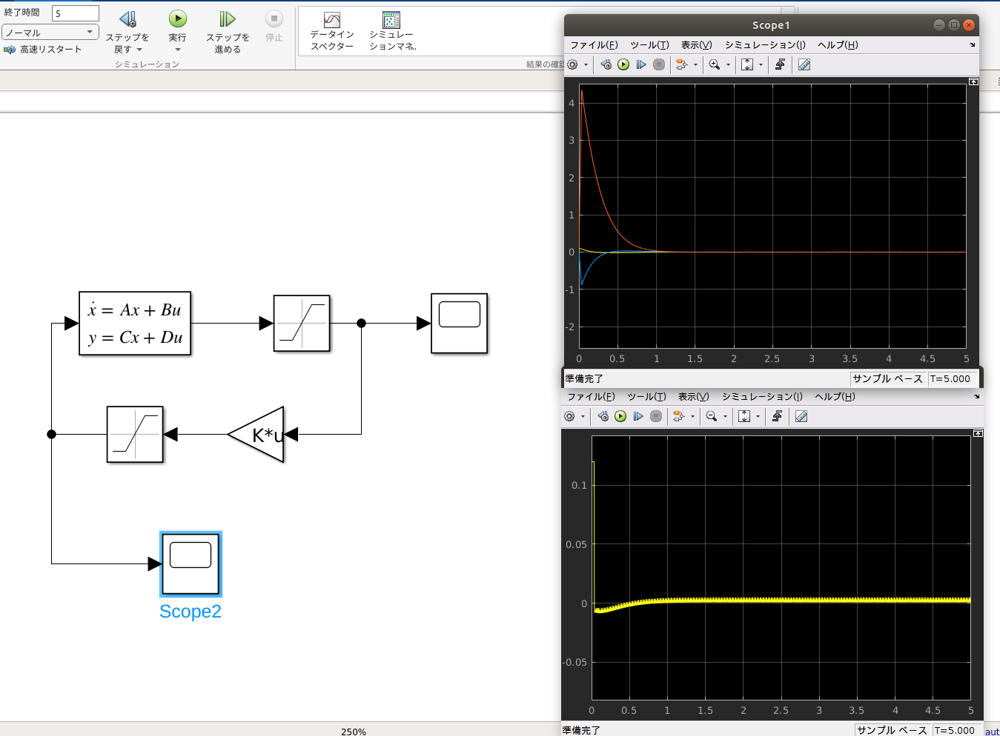

# puppy

## 使い方
### simulink上で制御する
puppy_sim.slxをsimulink上で開く。
### ゲインを求める
puppy_gain.mでLQRと極配置のフィードバックゲインを算出できる。
### 状態方程式のA,Bを求める
puppy_param.pyを実行する。詳しくはPUPPY_REV_3_2_1_0_s.pdfを見てください。

## memo
- モータの最大トルクは0.12[N.m]
- タイヤの最大角速度は44[rad/s]
